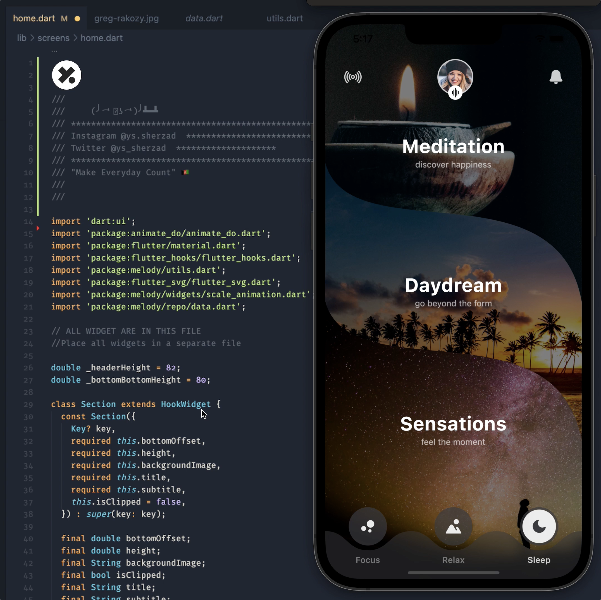

# Melody 👑
A health and lifestyle minimal concept



**Installation**

Clone the repo
```
git clone https://github.com/ys-sherzad/Melody.git
```
On you project directory

```
flutter pub get
```

Run the app
```
flutter run
```

Feel free to create an issue if you face any problems running the project.

**💬🥂 Hit me up:**
[ysherzad@dev](https://ysherzad.dev)
[@Instagram](https://www.instagram.com/ys.sherzad/)
[@Twitter](https://twitter.com/ys_sherzad) 